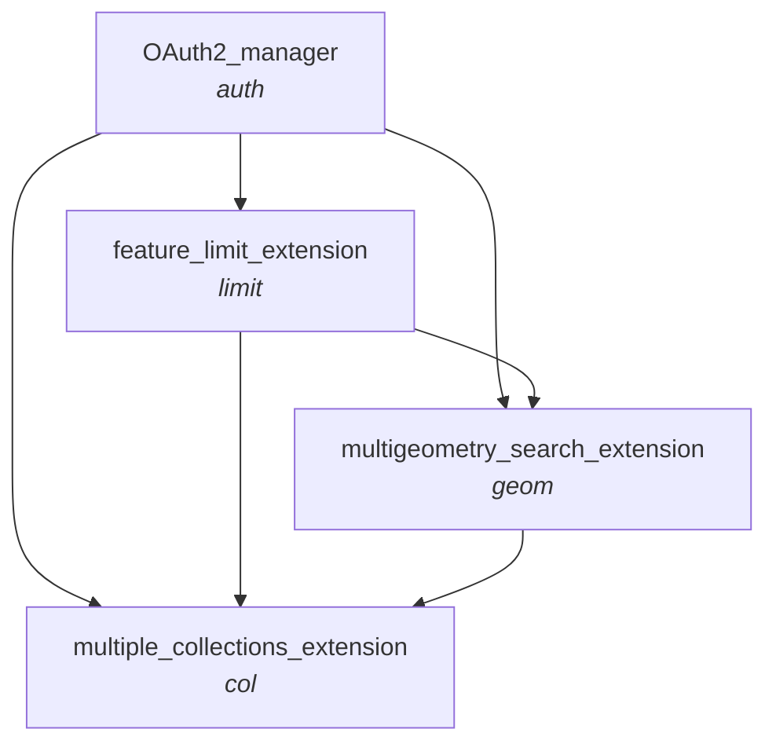

# Local Deployment
1. Create a .env file with OS DataHub account details:
    - CLIENT_ID =
    - CLIENT_SECRET = 
3. Create .venv with _python -m venv .venv_ and activate with _source .venv/bin/activate_
2. Install requirements with _pip install -r requirements.txt_
3. Launch flask application with _flask --app app\_flask/main run_
4. Access the development server on http://127.0.0.1:5000

# CatalyST-NGD-Wrappers

***Chart specifying valid orders to 'chain' different wrapper functions/extensions together***

- _Subtitles specifying the naming convention and ordering for python function names, and the corresponding final component of API paths_

- _Eg. the api url which combines OAuth2, the feature limit exentension, and the multiple collections extension will finish .../items/auth-limit-col?..._

