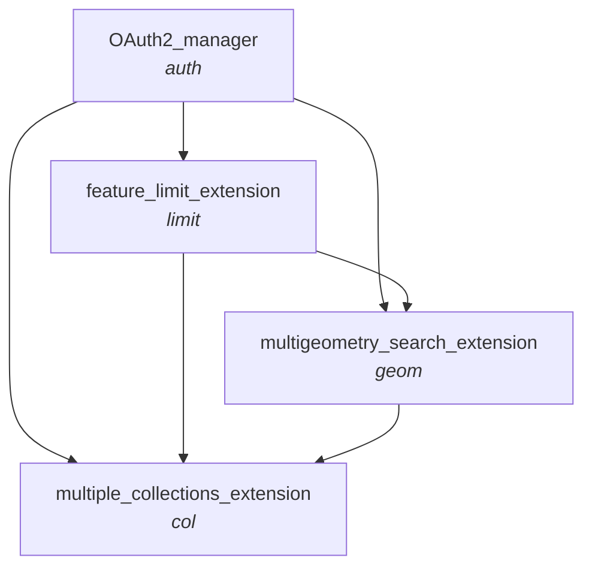

# CatalyST-NGD-Wrappers

***Chart specifying valid orders to "chain" different wrapper functions/extensions together***

- _Subtitles specifying the naming convention and ordering for python function names, and the corresponding final component of API paths_
- _Eg. the api url which combines the feature limit exentension, and the multiple collections extension will finish .../items/limit-col?..._



```
collection = ['bld-fts-building', 'trn-ntwk-road', 'wtr-fts-water']
use_latest_collection = True
wkt = 'GEOMETRYCOLLECTION (POLYGON ((400000 400000, 400090 400050, 400050 400000, 400000 40050, 400000 400000)), LINESTRING(399990 399990, 399000 399000))'
filter_crs = 27700
data = items_limit_geom_col(
    collection=collection,
    wkt=wkt,
    use_latest_collection=use_latest_collection,
    query_params = {
        'filter-crs': str(filter_crs),
        'limit': 300,
    })
```