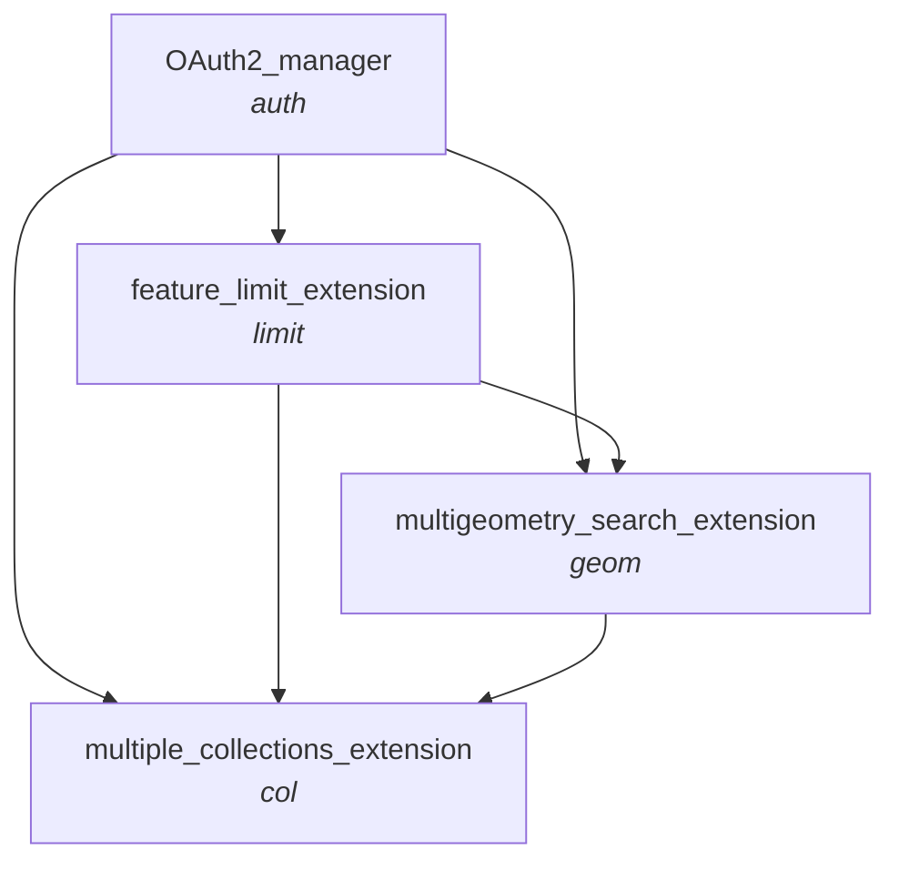

# Local Deployment
1. Create a .env file with OS DataHub account details, as specified in .env.sample
3. Create .venv with _python -m venv .venv_ and activate with _source .venv/bin/activate_
2. Install requirements with _pip install -r requirements.txt_
3. Launch flask application with _flask --app app\_flask/main run_
4. Access the development server on http://127.0.0.1:5000

# CatalyST-NGD-Wrappers

***Chart specifying valid orders to 'chain' different wrapper functions/extensions together***

- _Subtitles specifying the naming convention and ordering for python function names, and the corresponding final component of API paths_

- _Eg. the api url which combines OAuth2, the feature limit exentension, and the multiple collections extension will finish .../items/auth-limit-col?..._

# API Documentation

## OS NGD API - Features

- All the Catalyst APIs extend the core functionality of GET request for items using the OS NGD API - Features
    - The endpoint for this API is https://api.os.uk/features/ngd/ofa/v1/collections/{collectionId}/items
    - Documentation for the API can be found on the [OS Data Hub](https://osdatahub.os.uk/docs/ofa/overview) and on the [Gitbook docs for the National Geographic Database (NGD)](https://docs.os.uk/osngd/accessing-os-ngd/access-the-os-ngd-api/os-ngd-api-features/technical-specification)
    - As per the NGD API, the collectionId must be supplied

## Request Specifications
- *Path Parameters*:
    - _collectionId_ (string): Any collection available from the NGD, or "multi-collection" (for when col extension applied)
- *Query Parameters*:
    - Parameters consistent from OS NGD API - Features items request (refer to docs above for details)
        - key: string - OS DataHub project API Key
        - bbox: string
        - bbox-crs: string (xmin,ymin,xmax,ymax)
        - datetime: string (datetime)
        - filter: string
        - filter-crs: string
        - filter-lang: string
        - limit: integer
            - This can exceed the usual cap of 100 when the limit extension is applied.
            - Important: When used with _geom_ and/or _col_ exention, this limit applies per search area, per collection.
            The total number of features returned could therefore be much higher.
            - When used in conjunction with _request-limit_, the lower cap is applied.
            - Note: When used with _geom_ extension, the number of features returned per geom could be lower than _limit_ in some cases.
            This is because, if features overlap multiple search areas, duplicates are removed after the limit is reached.
        - _! offset_ - Not available when used with the limit extension 
    - Additional Catalyst attributes
        - filter_params: string (dict) - OS NGD attribute filters to pass to the query within the 'filter' query_param. The can be used instead of or in addition to manually setting the filter in query_params.
        The key-value pairs will appended using the EQUAL TO [ = ] comparator. Any other CQL Operator comparisons must be set manually in query_params.
        Queryable attributes can be found in OS NGD codelists documentation https://docs.os.uk/osngd/code-lists/code-lists-overview, or by inserting the relevant collectionId into the https://api.os.uk/features/ngd/ofa/v1/collections/{{collectionId}}/queryables endpoint.
        - filter_wkt: string (well-knwon text) - A means of searching a geometry for features. The search area(s) must be supplied in wkt, either in a string or as a Shapely geometry object.
        The function automatically composes the full INTERSECTS filter and adds it to the 'filter' query parameter.
        Make sure that 'filter-crs' is set to the appropriate value.
        - use-latest-collection (boolean, default False) - If True, it ensures that if a specific version of a collection is not supplied (eg. bld-fts-building<s>-2</s>), the latest version is used.
        Note that if use_latest_collection but 'collection' does specify a version, the specified version is always used regardless of use_latest_collection.
        - request-limit: integer (default 50) - the number of OS NGD Feature requests at which to cap the Catalyst request. Consider [pricing](https://osdatahub.os.uk/plans).
            - Important: When used with _geom_ and/or _col_ exention, this limit applies per search area, per collection.
            The total number of features returned could therefore be much higher.
            - When used in conjunction with _limit_, the lower cap is applied.
        - hierarchical-output: boolean, default False - If True, then results are returned in a hierarchical structure of GeoJSONs according to collection and/or search area, when the col and geom extensions are applied respectively.
        If False, results are returned as a single GeoJSON.
            - _geom_ and _col_ extension 
        - _collections: string (accepts multiple values)_ - Only when col extension is used. 
            - _col_ extension only

## Response Specifications
- **Format**
    GeoJSON by default. If the _hierarchical-output_ is True, a hierarchical json containing separate GeoJSONs according to collection and/or search area number.
- **Response Metadata**:
    - Attributes from OS NGD API - Features items request (refer to docs above for details)
        - type: string
        - timeStamp: string (date-time)
        - numberReturned: int
        - features: array of Feature (object)
        - _! links: array of Link (object)_ - This is absent if either _limit_ extension is applied, or if _hierarchical-output=False_ (if this attribute applies).
        This is because in these cases the GeoJSON(s) comprising the response do not represent a single NGD feature request.
    - Additional Catalyst attributes
        - source: string - Note on Catalyst/Geovation/Ordnance Survey
        - numberOfReqeusts: integer - The number of NGD items requests from which the final response is compiled
        - _numberOfRequestsByCollection: dict[str: int] (only when 'col' extension applied and hierarchical-output=False)_ - The number of NGD items requests made, split by collection
        - _numberReturnedByCollection: dict[str: int] (only when 'col' extension applied and hierarchical-output=False)_ - The number of features returned, split by collection
- **Feature-Level Attributes**
    - id: string (uuid) - OSID of the feature
    - collection: string - Collection the feature belongs to. This is an additional attribute supplied by catalyst
    - geometry: dict - List-like representation of the feature's geometry, and the geometry type
    - _searchAreaNumber : int | list (only when 'geom' extension applied and hierarchical-output=False)_ - The number of the search area where the feature is found. If a feature intersects multiple search areas, the numbers are given in a list.
    - properties: dict - Non-spatial ttribution associated with the feature
        - OS NGD attribution for each theme, collection, and feature type [here](https://docs.os.uk/osngd/data-structure)
        - The collection name is added by catalyst
        - When the geom extension is applied, the searchAreaNumber value is also included
    - type: string - object type ("Feature")
- *Response Codes*
    [pending]

## Summary of Extensions

|Extension|Extra Query Parameters|Description|Notes & Constaints|
|---|---|---|---|
|auth||Handles autentication via CatalyST|
|limit|request-limit|Extends the maximum number of features returned above the default maximum 100 by looping through multiple OS NGD API - Features requests.|Default value of 50. This can be increased manually. When request-limit and limit are both supplied, the lower constraint is applied. When combined with geom and/or col, the limit applies per search area, per collection.|
|geom|hierarchical-output|An alternative means of returning OS NGD features for a search area which is a Multi-Geometry (MultiPoint, MultiLinestring, MultiPolygon, or GeometryCollection), which will in some cases improve speed, performance, and prevent the call from timing out. Each geometry is assigned a 'searchAreaNumber', and each search area is searched in turn for features, with the search area numbers returned in feature properties, and as feature metadata.|When a feature overlaps with multiple search areas, it is returned once when hierarchical-output=Flalse, with searchAreaNumber returning a list. When hierarchial-output=True, the feature is repeated in the output for each search area.|
|col|hierarchical-output, collections|Enables multiple OS NGD collections to be searched at once. Each collection value supplied as query parameters is searched in turn for features, with the collection returned in feature properties, and as feature metadata.|{collectionId} path parameter must be 'multi-collection'. When combined with the geom extension, requests are subdivided into collections first, and then into search areas.|
|_all of above_|filter-wkt, use-latest-collection|||

## Available endpoints resulting from extension combinations
- catalyst/features/ngd/ofa/v1/collections/{collectionId}/items
- catalyst/features/ngd/ofa/v1/collections/{collectionId}/items/limit
- catalyst/features/ngd/ofa/v1/collections/{collectionId}/items/geom
- catalyst/features/ngd/ofa/v1/collections/multi-collection/items/col
- catalyst/features/ngd/ofa/v1/collections/{collectionId}/items/limit-geom
- catalyst/features/ngd/ofa/v1/collections/multi-collection/items/limit-col
- catalyst/features/ngd/ofa/v1/collections/multi-collection/items/geom-col
- catalyst/features/ngd/ofa/v1/collections/multi-collection/items/limit-geom-col
- catalyst/features/ngd/ofa/v1/collections/{collectionId}/items/auth-limit
- catalyst/features/ngd/ofa/v1/collections/{collectionId}/items/auth-geom
- catalyst/features/ngd/ofa/v1/collections/multi-collection/items/auth-col
- catalyst/features/ngd/ofa/v1/collections/{collectionId}/items/auth-limit-geom
- catalyst/features/ngd/ofa/v1/collections/multi-collection/items/auth-limit-col
- catalyst/features/ngd/ofa/v1/collections/multi-collection/items/auth-geom-col
- catalyst/features/ngd/ofa/v1/collections/multi-collection/items/auth-limit-geom-col