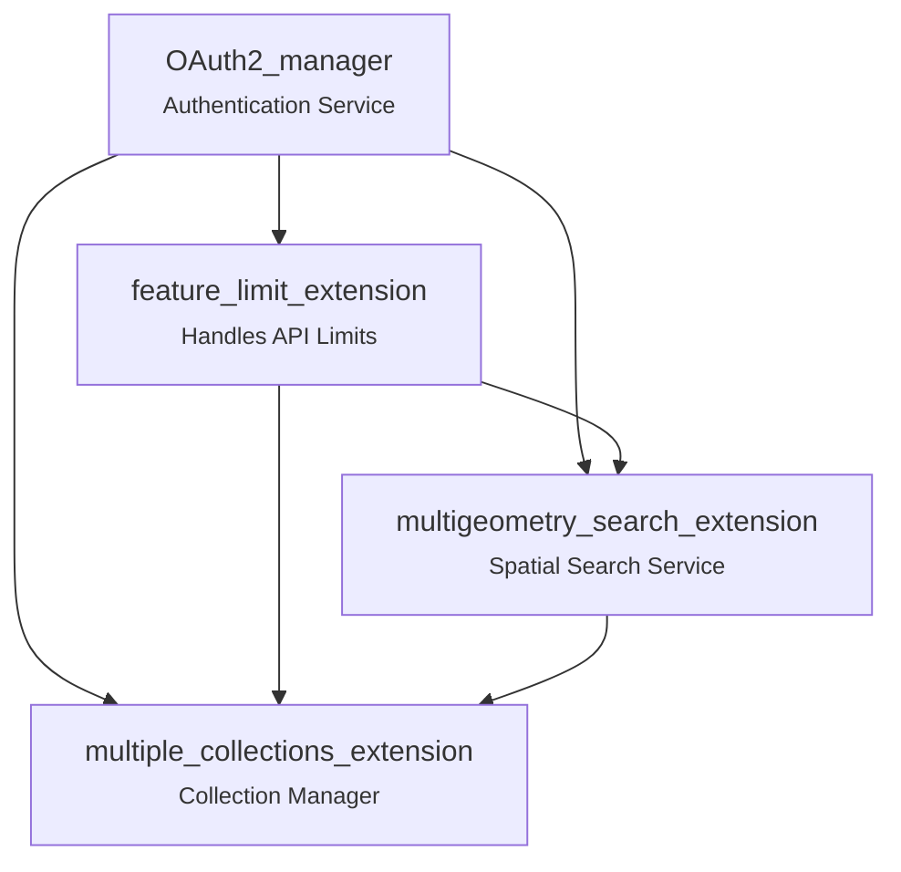

# Local Deployment
1. Create a .env file with OS DataHub account details:
    - CLIENT_ID =
    - CLIENT_SECRET =
2. Create .venv with _python -m venv .venv_ and activate with _source .venv/bin/activate_
3. Launch flask application with _flask --app app\_flask/main run_
4. Access the development server on http://127.0.0.1:5000

# CatalyST-NGD-Wrappers

***Chart specifying valid orders to 'chain' different wrapper functions/extensions together***

