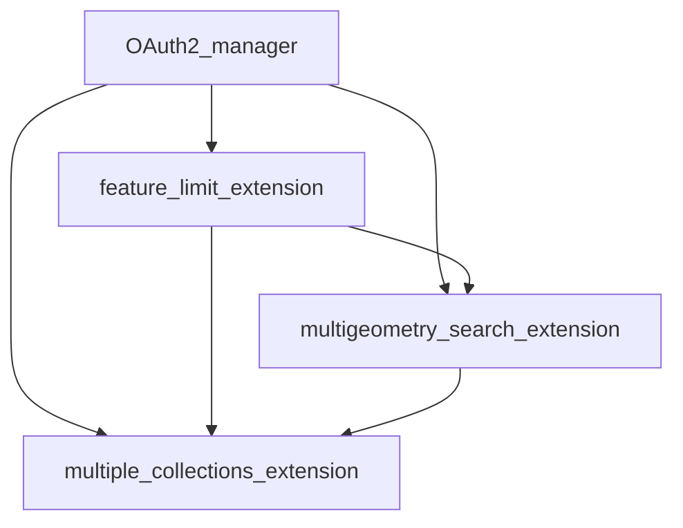

# CatalyST-NGD-Wrappers

***Chart specifying valid orders to 'chain' different wrapper functions/extensions together***

```mermaid
graph TD
    A[OAuth2_manager] --> B[feature_limit_extension]
    A --> C[multigeometry_search_extension]
    A --> D[multiple_collections_extension]
    B --> C
    B --> D
    C --> D
```