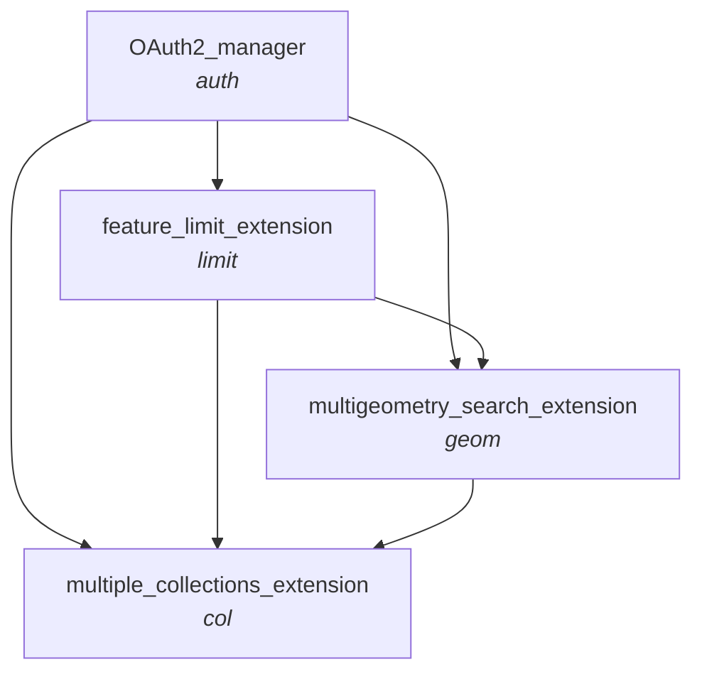

# Local Deployment with Azurite
1. Create a .env file with OS DataHub account details, as specified in .env.sample
3. Create .venv with _python -m venv .venv_ and activate with _source .venv/bin/activate_
2. Install requirements with _pip install -r requirements.txt_
3. Launch azurite, making sure you have Azurite installed within your virtual environment
4. Launch the functions by navigating to the Azure folder and running _func start_.
5. Access the development server on http://localhost:7071/api

# CatalyST-NGD-Wrappers

***Chart specifying valid orders to "chain" different wrapper functions/extensions together***

- _Subtitles specifying the naming convention and ordering for python function names, and the corresponding final component of API paths_

- _Eg. the api url which combines OAuth2, the feature limit exentension, and the multiple collections extension will finish .../items/auth-limit-col?..._

# API Documentation

## OS NGD API - Features

- All the Catalyst APIs extend the core functionality of GET request for items using the OS NGD API - Features
    - The endpoint for this API is https://api.os.uk/features/ngd/ofa/v1/collections/{collectionId}/items
    - Documentation for the API can be found on the [OS Data Hub](https://osdatahub.os.uk/docs/ofa/overview) and on the [Gitbook docs for the National Geographic Database (NGD)](https://docs.os.uk/osngd/accessing-os-ngd/access-the-os-ngd-api/os-ngd-api-features/technical-specification)

## Request Specifications
- **Path Parameters**
    - **collectionId**: str - Any collection available from the NGD, or "multi-collection" (for when _col_ extension applied)
- **Query Parameters inherited from OS NGD API - Features items request** (refer to docs above for details)
    - **key**: str - OS DataHub project API Key
    - **bbox**: str
    - **bbox-crs**: str (xmin,ymin,xmax,ymax)
    - **datetime**: str (datetime)
    - **filter**: str
    - **filter-crs**: str
    - **filter-lang**: str
    - **limit**: int
        - This can exceed the usual cap of 100 when the _limit_ extension is applied.
        - **$${\color{red}IMPORTANT}$$**: When used with _geom_ and/or _col_ exention, this limit applies <ins>per search area, per collection</ins>.
        The total number of features returned could therefore be much higher.
        - When used in conjunction with _request-limit_, the lower cap is applied.
        - **$${\color{red}Note}$$**: When used with _geom_ extension, the number of features returned per _geom_ could be lower than _limit_ in some cases.
        This is because, if features overlap multiple search areas, duplicates are removed after the limit is reached.
    - **offset**: int - Not available when used with the _limit_ extension 
- **Additional Catalyst Query Parameters**
    - **filter_params**: str (dict) - OS NGD attribute filters to pass to the query within the _filter_ query parameter. The can be used instead of or in addition to manually setting the filter in _query\_params_.
    The key-value pairs will appended using the EQUAL TO [ = ] comparator. Any other CQL Operator comparisons must be set manually in query_params.
    Queryable attributes can be found in OS NGD [codelists documentation](https://docs.os.uk/osngd/code-lists/code-lists-overview), or by inserting the relevant collectionId into the https://api.os.uk/features/ngd/ofa/v1/collections/{{collectionId}}/queryables endpoint.
    - **wkt**: str (well-knwon text) - A means of searching a geometry for features. The search area(s) must be supplied in wkt, either in a str or as a Shapely geometry object.
    The function automatically composes the full INTERSECTS filter and adds it to the _filter_ query parameter.
    Make sure that _filter-crs_ is set to the appropriate value.
    - **use-latest-collection** (bool, default False) - If True, it ensures that if a specific version of a collection is not supplied (eg. "bld-fts-building<s>-2</s>"), the latest version is used. If _use-latest-collection=True_ but the given collection does include a version, the specified version is always used regardless of use_latest_collection.
    - **request-limit**: int (default 50) - the number of OS NGD Feature requests at which to cap the Catalyst request. Consider [pricing](https://osdatahub.os.uk/plans).
        - **$${\color{red}IMPORTANT}$$**: When used with _geom_ and/or _col_ exention, this limit applies <ins>per search area, per collection</ins>.
        The total number of features returned could therefore be much higher.
        - When used in conjunction with _limit_, the lower cap is applied.
    - **hierarchical-output**: bool, default False - If True, then results are returned in a hierarchical structure of GeoJSONs according to collection and/or search area, when the _col_ and _geom_ extensions are applied respectively.
    If False, results are returned as a single GeoJSON.
        - _geom_ and _col_ extensions only.
    - **collections**: str (accepts multiple values)
        - _col_ extension only.

## Response Specifications
- **Format**
    GeoJSON by default. If the _hierarchical-output=True_, a hierarchical json containing separate GeoJSONs according to collection and/or search area number.
- **Response Metadata**:
    - Attributes from OS NGD API - Features items request (refer to docs above for details)
        - **type**: str
        - **timeStamp**: str (date-time) - Format "YYYY-MM-DDTHH:MM:SS.sssssssZ"
        - **numberReturned**: int
        - **features**: array of Feature (object)
        - **links** - This is absent if either _limit_ extension is applied, or if _hierarchical-output=False_ (if this attribute applies).
        This is because in these cases the GeoJSON(s) comprising the response do not represent a single NGD feature request.
    - Additional Catalyst attributes
        - **source**: str - Note on Catalyst/Geovation/Ordnance Survey
        - **numberOfReqeusts**: int - The number of NGD items requests from which the final response is compiled
        - **numberOfRequestsByCollection**: dict[str: int] - The number of NGD items requests made, split by collection. Only included when _col_ extension applied and _hierarchical-output=False_.
        - **numberReturnedByCollection**: dict[str: int] - The number of features returned, split by collection. 
- **Feature-Level Attributes**
    - **id**: str (uuid) - OSID of the feature
    - **collection**: str - Collection the feature belongs to. This is an additional attribute supplied by catalyst
    - **geometry**: dict - List-like representation of the feature's geometry, and the geometry type
    - **searchAreaNumber**: int | list - The number of the search area where the feature is found. If a feature intersects multiple search areas, the numbers are given in a list. Only inclded when _geom_ extension applied and _hierarchical-output=False_. 
    - **properties**: dict - Non-spatial attribution associated with the feature
        - OS NGD attribution for each theme, collection, and feature type [here](https://docs.os.uk/osngd/data-structure)
        - The collection name is added by catalyst
        - When the _geom_ extension is applied, the searchAreaNumber value is also included
    - **type**: str - object type ("Feature")
- **Response Codes**
    
    For error responses (all except 200), the 'errorSource' attribute specifies whether the error was thrown from the OS NGD API, or from the surrounding Catalyst wrapper.
    | Response Code | Description   |
    |---------------|-------------------------------------------------------------------------------------------------------|
    | **200**       | A list of features in a feature collection, or a hierarchical dictionary of feature collections.  |
    | **400**       | The items request is not supported. Please refer to documentation for examples.   |
    | **401**       | Missing or unsupported API key. Please ensure you include a key for a project that has OS NGD API - Features added.   |
    | **404**       | A/the collection is not a supported. Please refer to the documentation for a list of supported collections.   |
    | **405**       | The HTTP method requested is not supported. This endpoint only supports "GET" requests.   |
    | **406**       | A request header value was not supported. |
    | **414**       | The request URI is too long. Please simplify the geometry filter and/or use simpler attribute filters. |
    | **500**       | Unexpected/unknown error.    |
    | **504**       | The request has timed out. Please check the service availability dashboard: [OS Data Hub Service Status](https://osdatahub.os.uk/serviceStatus).  |

## Summary of Extensions

|Extension|Extra Query Parameters|Description|Notes & Constaints|
|---|---|---|---|
|**_all of below_**|wkt, use-latest-collection|Basic wrapper for OS NGD API - Features, with some extra query parameters.||
|**limit**|request-limit|Extends the maximum number of features returned above the default maximum 100 by looping through multiple OS NGD API - Features requests.|Default value of 50. This can be increased manually. When _request-limit_ and _limit_ are both supplied, the lower constraint is applied. When combined with _geom_ and/or _col_, the limit applies <ins>per search area, per collection.</ins>|
|**geom**|hierarchical-output|An alternative means of returning OS NGD features for a search area which is a Multi-Geometry (MultiPoint, MultiLinestring, MultiPolygon, or GeometryCollection), which will in some cases improve speed, performance, and prevent the call from timing out. Each geometry is assigned a "searchAreaNumber", and each search area is searched in turn for features, with the search area numbers returned in feature properties, and as feature metadata.|When a feature overlaps with multiple search areas, it is returned once when _hierarchical-output=Flalse_, with searchAreaNumber returning a list. When _hierarchial-output=True_, the feature is repeated in the output for each search area.|
|**col**|hierarchical-output, collections|Enables multiple OS NGD collections to be searched at once. Each collection value supplied as query parameters is searched in turn for features, with the collection returned in feature properties, and as feature metadata.|{collectionId} path parameter must be "multi-collection". When combined with the _geom_ extension, requests are subdivided into collections first, and then into search areas.|

## Available endpoints resulting from extension combinations

- Make sure to prefix the endpoints below with one of the following
    - Cloud server: https://catalyst-ngd-wrapper-functions.azurewebsites.net/api/
    - Local azurite deployment: http://localhost:7071/api/

- catalyst/features/ngd/ofa/v1/collections/{collectionId}/items
- catalyst/features/ngd/ofa/v1/collections/{collectionId}/items/limit
- catalyst/features/ngd/ofa/v1/collections/{collectionId}/items/geom
- catalyst/features/ngd/ofa/v1/collections/multi-collection/items/col
- catalyst/features/ngd/ofa/v1/collections/{collectionId}/items/limit-geom
- catalyst/features/ngd/ofa/v1/collections/multi-collection/items/limit-col
- catalyst/features/ngd/ofa/v1/collections/multi-collection/items/geom-col
- catalyst/features/ngd/ofa/v1/collections/multi-collection/items/limit-geom-col